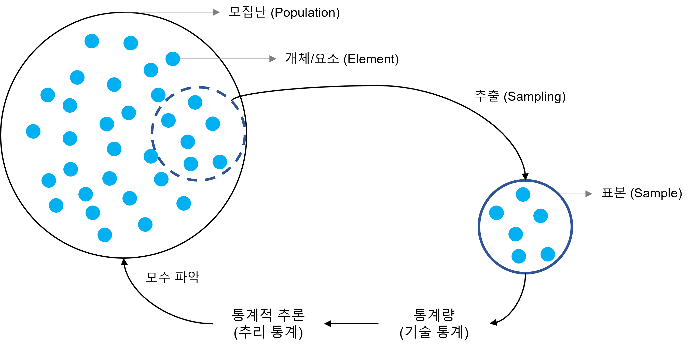

# 1. 통계학이란

## 통계학의 정의 및 개요
### 통계학이란?
산술적 방법을 기초로 하여, 주로 다량의 데이터를 관찰하고 정리 및 분석하는 방법을 연구하는 수학의 한 분야.  
[Wikipedia : 통계학](https://ko.wikipedia.org/wiki/%ED%86%B5%EA%B3%84%ED%95%99)

- **기술통계학** (記述 統計學, descriptive statistics)
    - 측정이나 실험에서 수집한 자료(data)의 정리, 요약, 해석, 표현등을 통해 자료의 특성을 규명하는 통계적 방법.   [Wikipedia : 기술통계학](https://ko.wikipedia.org/wiki/%EA%B8%B0%EC%88%A0%ED%86%B5%EA%B3%84%ED%95%99)
    - 수치를 사용하여 요약하거나 그래프와 같은 시각화를 통해 자료의 특성을 파악
    - [자료]

- **추론통계학** (推論 統計學 , Inferential statistics)
    - 모집단에 대한 어떤 미지의 양상을 알기 위해 통계학을 이용하여 추측하는 과정을 지칭한다.   [Wikipedia : 통계적추론](https://ko.wikipedia.org/wiki/%ED%86%B5%EA%B3%84%EC%A0%81_%EC%B6%94%EB%A1%A0)
    - **표본(sample)으로 모집단의 특성(모수)을 추론하는 것**
    - 추정 (Estimation)
        - 표본으로부터 모집단의 모수에 대해 추측하는 과정,
    - 가설검정 (testing hypothesis)
        - 모집단 실제값이 얼마나 되는가 하는 주장과 관련해서, 표본이 가지고 있는 정보를 이용해 가설이 올바른지 그렇지 않은지 판정하는 과정을 나타낸다.
        - 귀무가설, 대립가설

## 자료의 종류
### 통계학에서의 자료의 구분

- **질적 자료(qualitative data)**
    - 수치로 측정이 불가능한 자료이다. 분류 자료 또는 범주형 자료 (categorical data)라고도 한다.   [Wikipedia : 자료](https://ko.wikipedia.org/wiki/%EC%9E%90%EB%A3%8C)
    - 명목 자료 (nominal data) : 순위의 개념이 없다.   ex) 혈액형, 성별, 등번호
    - 순서 자료 (ordinal data) : 순위의 개념을 갖는다.   ex) 계급, 선호도, 옷 사이즈
    - 경우에 따라 질적 자료가 숫자로 표현되기도 하나 그 숫자들이 양적인 크기를 나타내는 것은 아니다.   ex) 교육수준 : 중졸 > 1, 고졸 > 2, 대졸 > 3

- **양적 자료(quantitative data) 또는 수치형 자료(numerical data)**
    - 양적 자료(quantitative data, 정량적 자료)는 수치로 측정이 가능한 자료이다. 또는 수치적 자료(Numerical data)라고 하기도 합니다.   [Wikipedia : 자료](https://ko.wikipedia.org/wiki/%EC%9E%90%EB%A3%8C)
    - 연속형 자료 (continuous data)   ex) 키, 몸무게, 길이, 온도, 무게
    - 이산형 자료 (discrete data)   ex) 사고 건수, 고객 수, 불량품의 수
    - 경우에 따라 양적 자료는 범주화가 가능   ex) 시험 성적에 따라 "수, 우, 미, 양, 가" 그룹화