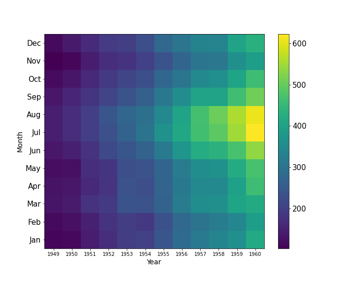

# 2. 기술 통계학

## 그래프에 의한 기술통계
### 그래프를 이용한 자료의 정리
- 히스토그랩, 상자그림, 산점도, 파이그림, 막대그림 등을 이용하여 한 눈에 알아볼 수 있게 자료를 정리할 수 있음.
- 질적 자료(범주형)인 경우
    - 1개 변수 : 막대 그림, 파이 그림
    - 2개 변수 : 스택트컬럼차트, 히트맵  
    *[파이 차트]* 
     
    *[히트맵 차트]* 
     
- 양적 자료 인 경우
    - 1개 변수 : 히스토그램, 상자그림 (Box plot)
    - 2개 변수 : 산점도 
    *[히스토그램 차트]* 
    

## 수치적 기술통계
### 중심 위치 척도

|척도|정의|특징|
|:---:|:-----:|---|
|평균 (mean)|표본 자료 $x_1,...,x_n$이 주어졌을 때,   $$\overline{x}=\frac{\sum_{i=1}^{n} x_i}{n}$$|산술평균. 가장 많이 쓰이는 중심위치 척도.   이상치에 민감|
|중앙값 (mediam)|표본 자료를 오름차순 정렬한 $x_{(1)} \leq ... \leq x_{(n)}$에 대하여,  $$x_{med} = \begin{cases} x_{((n+1)/2)} & , n\text{이 홀수} \\ \frac{x_{(n/2)} + x_{(n/2+1)}}{2} & , n\text{이 짝수} \end{cases}$$|크기 순으로 정렬했을 때의 가운데 값에 해당. 이상치의 영향을 받지 않음.|
|최빈값 (mode)|가장 많이 관측되는 수, 가장 자주 나오는 값|연속형 자료의 경우 빈도가 높은 구간이 적절함.|

### 상대적 위치 척도

|척도|정의|특징|
|:-----:|:---:|---|
|$p- \text{퍼센타일}$ (백분위수)|$$x_{(p(n+1)/100)}$$|자료의 p%는 이 값보다 작거나 같고, (1-p)%는 이 값보다 크거나 같다.
|Q1|$$x_{((n+1)/4)}$$|25-퍼센타일|
|Q2|$$x_{(2(n+1)/4)}$$|50-퍼센타일 (=중앙값)|
|Q2|$$x_{(3(n+1)/4)}$$|75-퍼센타일|

### 변동성 척도

|척도|정의|특징|
|:-----:|:---:|---|
|범위 (range)|$$max(x_i)-min(x_i)$$|측정값의 최소, 최대 값, 이상치의 영향이 큼.|
|사분범위 (IQR)|$$Q3-Q1$$|이상치의 영향을 덜 받음.|
|분산 (variance)|$$s^2=\frac{\sum_{i=1}^{n} (x_i-\overline{x})^2}{n-1}$$|가장 대표적인 변동성 척도임. 괸측값에서 평균을 뺀 값을 제곱하고, 그것을 모두 더한 후 전체 개수로 나눠서 구함. 즉, 차이값의 제곱의 평균|
|표준편차|$$s=\sqrt {s^2}$$|분산의 제곱근.
|변동계수|$$s/\overline{x}$$|평균 차이가 큰 자료들 혹은 단위가 다른 자료들의 변동성 비교에 유용함.|

### 분포의 형태에 관한 척도
- 왜도 : 확률 변수의 확률 분포의 비대성을 나타내는 지표.   [Wikipedia : 비대칭도](https://ko.wikipedia.org/wiki/%EB%B9%84%EB%8C%80%EC%B9%AD%EB%8F%84)
    - 양의 왜도 : 오른쪽 꼬리가 길게 늘어진 형태
    - 음의 왜도 : 왼쪽 꼬리가 길게 늘어진 형태  
- 첨도 : 확률분포의 꼬리가 두꺼운 정도를 나타내는 척도.   [Wikipedia : 첨도](https://ko.wikipedia.org/wiki/%EC%B2%A8%EB%8F%84)
    - 양의 첨도 : 정규분포에 비해 꼬리가 얇고 봉우리가 뾰족한 형태
    - 음의 첨도 : 정규분포에 비해 꼬리가 두껍고 봉우리가 뭉툭한 형태 
    *[왜도/첨도]* 
    